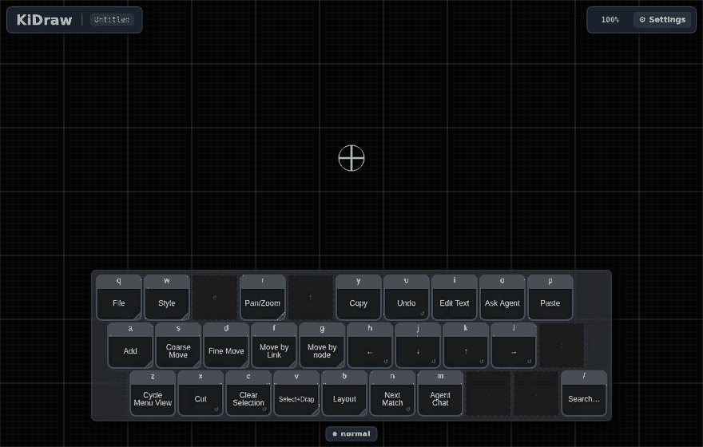

# KiDraw

**A diagramming tool you drive from the keyboard.** You move a crosshair
around the canvas with `h` `j` `k` `l`, and an on-screen keyboard, the
*keymenu*, shows what every key does right now. Hold a key and its card
changes to show what the next key will do. No toolbar, no dragging, nothing
to memorize first.



*Above, with keys only: tap `a` and type a label; hold `a` and tap `l`, then
`j`, to grow connected boxes to the right and below; hold `b` and tap `j` to
lay the graph out as a tree.*

## What's interesting here

- **The keyboard explains itself.** The keymenu is drawn from the same table
  of key bindings the app runs on, so it cannot drift from what the keys do.
  Held keys open submenus; a cut corner on a card means "hold me". Chords are
  checked for what one hand can physically press
  ([notes/design-chord-ergonomics.md](notes/design-chord-ergonomics.md)).
- **Adding is aiming.** Holding Add over a box shows where the next box can
  go; the movement keys walk the choices and letting go puts it there, joined
  to the box you started from.
- **Layouts and edge routing** written for this app: force, trees and radial
  layouts that keep edges from passing through boxes, and a router that bends
  edges around what is in their way.
- **Plugins** add diagram types (a todo graph, an explanation graph, a kanban
  board written in YAML) with their own menus and commands. An **AI agent**
  can read and edit the graph through the same operations, undoable as one
  step ([docs/plugins.md](docs/plugins.md), [agent/](agent/README.md)).
- **Files you own.** A graph is a YAML document plus a style sheet, kept in a
  folder on your disk ([docs/file-format.md](docs/file-format.md)).
- **Tested two ways.** About 900 unit tests, and about 55 browser scripts that
  drive the running app with real key presses
  ([tools/qa/README.md](tools/qa/README.md)).

## Try it

```bash
npm install
npm start          # the app at http://localhost:4200
```

Then, with the page focused:

| Keys | What happens |
| :--- | :--- |
| `a`, type, `Esc` `Esc` | A box under the crosshair; type its label; leave editing |
| hold `a`, tap `l`, let go | A connected box to the right, ready for its label |
| `h` `j` `k` `l` | Move the crosshair |
| hold `b`, tap `j` | Lay the graph out as a tree |
| hold `b`, tap `h` | Gather a box's neighbors around it; again to put them back |
| hold `q` | The File menu: Open, Save As, Diagram Type |
| `z` | Full keyboard, compact panel, or hidden |

Whatever the cards show is what the keys do.

## Find your way around

- [ARCHITECTURE.md](ARCHITECTURE.md): the whole system on one page, and a
  reading order for the code.
- [notes/README.md](notes/README.md): design decisions, ideas and bugs, each
  marked with who decided it.
- [dev-status.md](dev-status.md): where development stands.

Built with Angular 19, TypeScript and [Konva](https://konvajs.org/).

## Development

```bash
npm start                                              # dev server + log collector
npx ng build                                           # production build and type check
npx ng test --watch=false --browsers=ChromeHeadless    # unit tests
npm run qa                                             # browser scripts (needs npm start)
```

The README's animation is recorded from the running app:
`node tools/capture/readme-gif.mjs`, then
`uvx --with pillow python tools/capture/make-gif.py .capture/readme docs/readme-demo.gif`.
