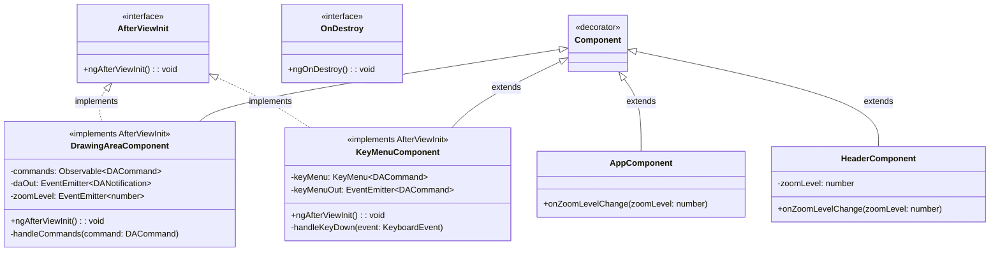
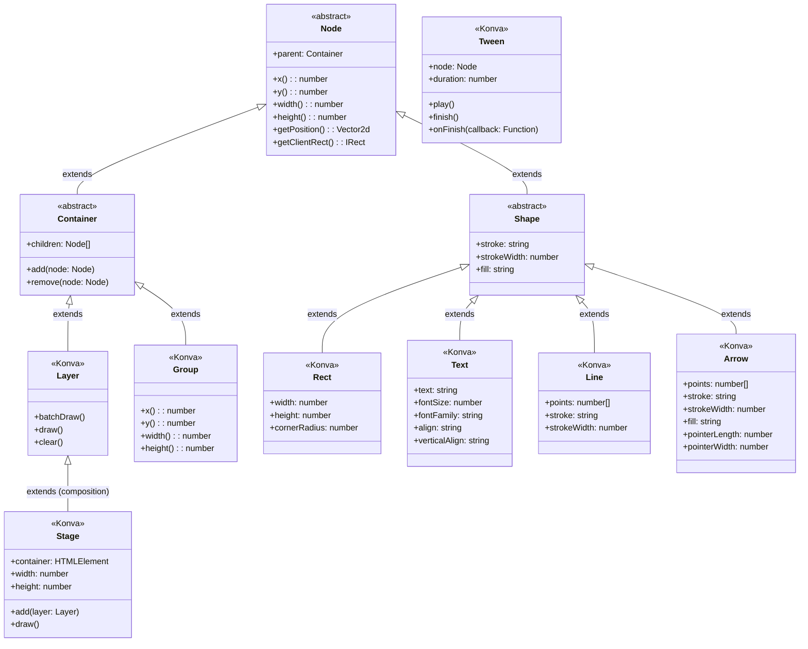
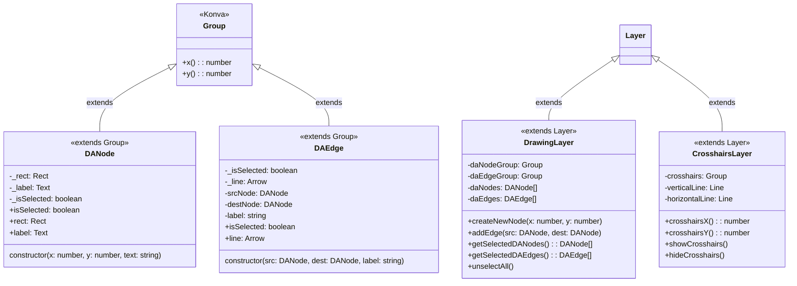
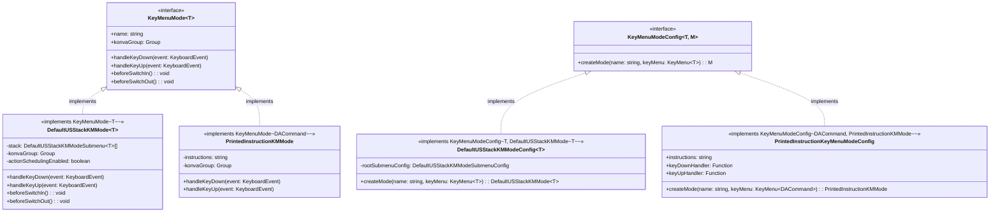
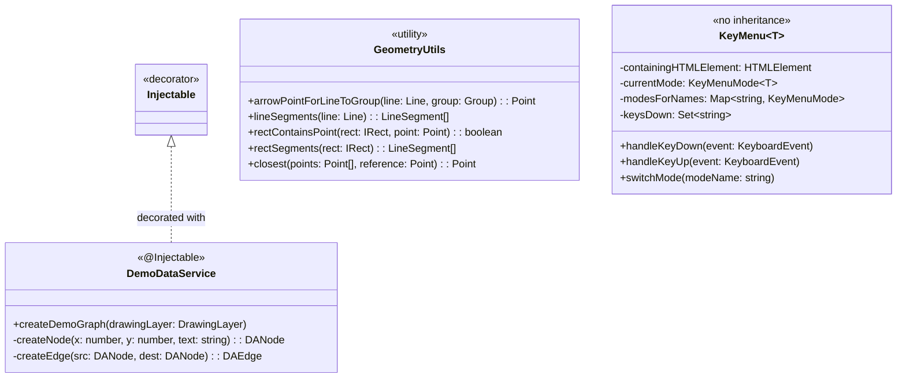
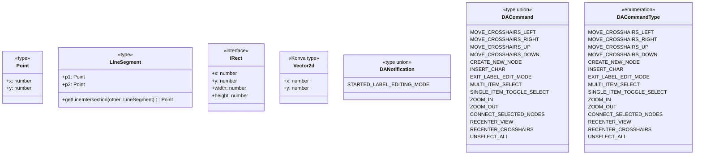

# Class Inheritance and Interface Implementation Diagrams

## 1. Angular Component Hierarchy

## 2. Konva.js Inheritance Hierarchy

## 3. Custom Drawing Classes

## 4. KeyMenu System Interfaces

## 5. Service and Utility Classes

## 6. Type Definitions and Models

## 7. Summary of Inheritance Relationships

### Angular Components
- **All components extend** `Component` (via decorator)
- **DrawingAreaComponent & KeyMenuComponent implement** `AfterViewInit`
- **No custom interfaces** for components

### Konva-based Classes
- **DANode extends** `Group` (Konva)
- **DAEdge extends** `Group` (Konva)  
- **DrawingLayer extends** `Layer` (Konva)
- **CrosshairsLayer extends** `Layer` (Konva)
- **All visual elements extend** Konva base classes

### KeyMenu System
- **DefaultUSStackKMMode implements** `KeyMenuMode<T>`
- **PrintedInstructionKMMode implements** `KeyMenuMode<T>`
- **Config classes implement** `KeyMenuModeConfig<T, M>`

### Services
- **DemoDataService decorated with** `@Injectable` (Angular)
- **No inheritance** - standalone utility class

### Utility Classes
- **GeometryUtils**: Static utility functions, no inheritance
- **Type definitions**: TypeScript types and interfaces, no inheritance

### Key Patterns
- **Composition over inheritance** for most custom classes
- **Interface implementation** for KeyMenu system
- **Konva inheritance** for visual rendering
- **Angular decorators** for component/service registration
