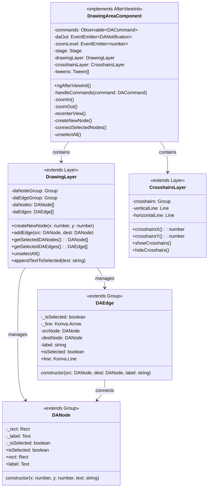
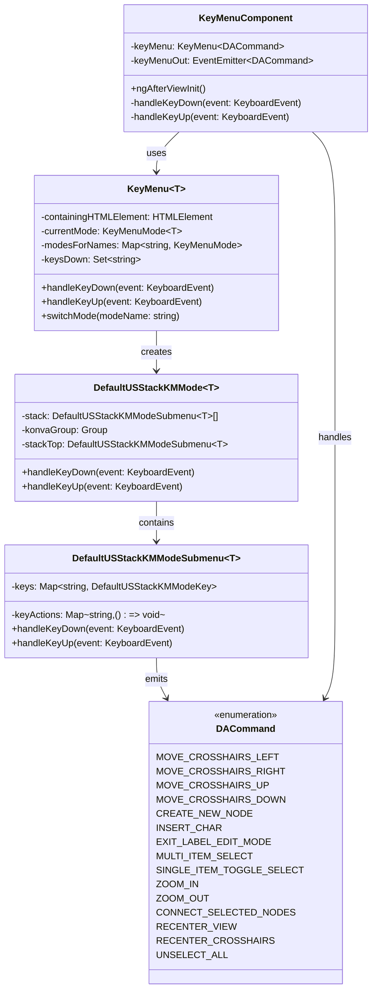
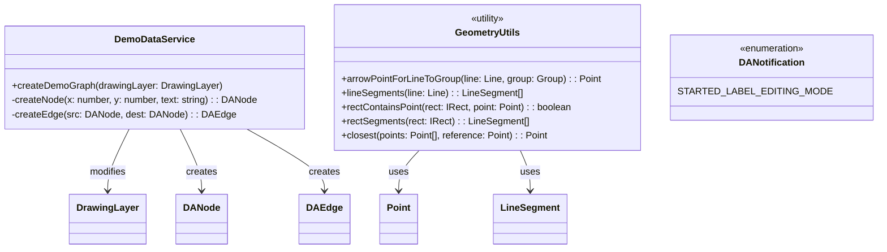
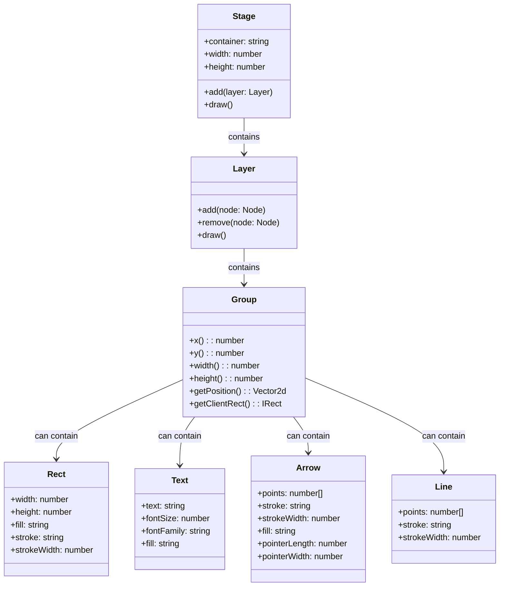
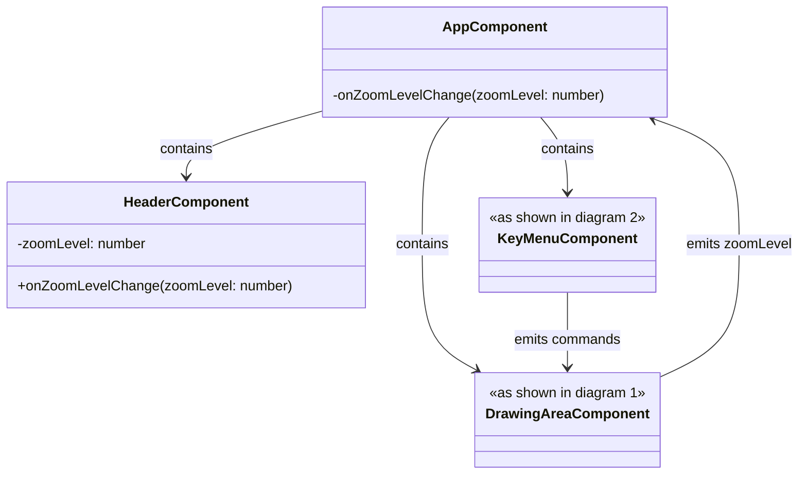
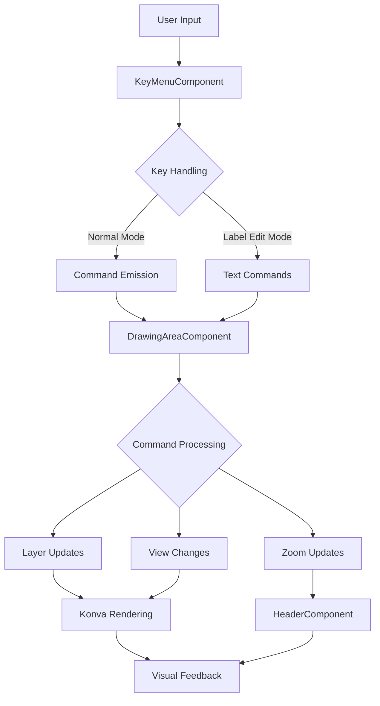

# UML Diagrams for Kidraw Application

## 1. Core Drawing Architecture

## 2. Input/Command System

## 3. Service Layer

## 4. Konva Integration Layer

## 5. Component Hierarchy (Angular)

## 6. Data Flow Architecture

## 7. Class Relationships Summary

### Core Entities
- **DrawingAreaComponent**: Main orchestrator, handles user commands
- **DrawingLayer**: Manages graph elements (nodes/edges)
- **CrosshairsLayer**: Manages crosshair display
- **DANode**: Visual representation of graph nodes
- **DAEdge**: Visual representation of graph edges

### Input System
- **KeyMenuComponent**: Handles keyboard input
- **KeyMenu**: Manages different input modes
- **DefaultUSStackKMMode**: Implements vim-like key bindings
- **DACommand**: Command objects for user actions

### Supporting Infrastructure
- **DemoDataService**: Creates sample graphs
- **GeometryUtils**: Mathematical calculations
- **Konva Classes**: Low-level rendering primitives

### Key Patterns
- **Observer Pattern**: Event emitters for communication
- **Command Pattern**: DACommand objects encapsulate user actions
- **Strategy Pattern**: Different key modes (normal, label edit)
- **Composition Pattern**: Konva groups contain visual elements
- **Factory Pattern**: DemoDataService creates graph elements
