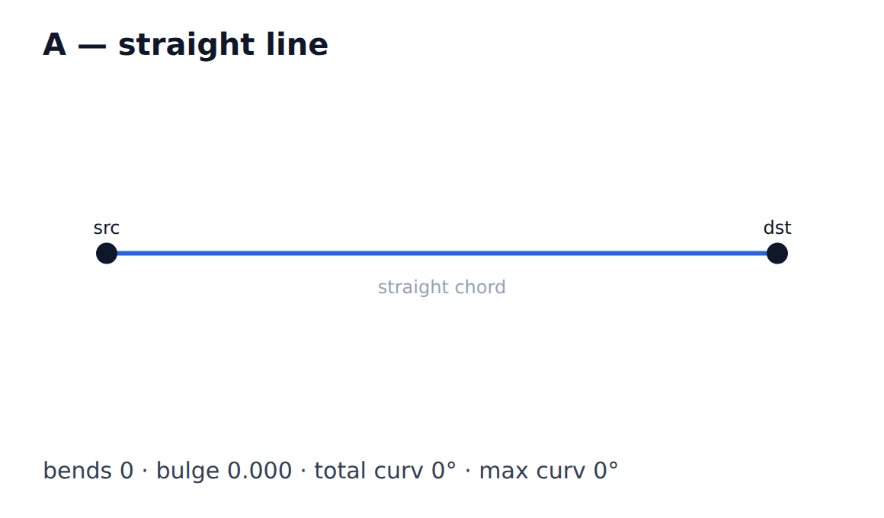
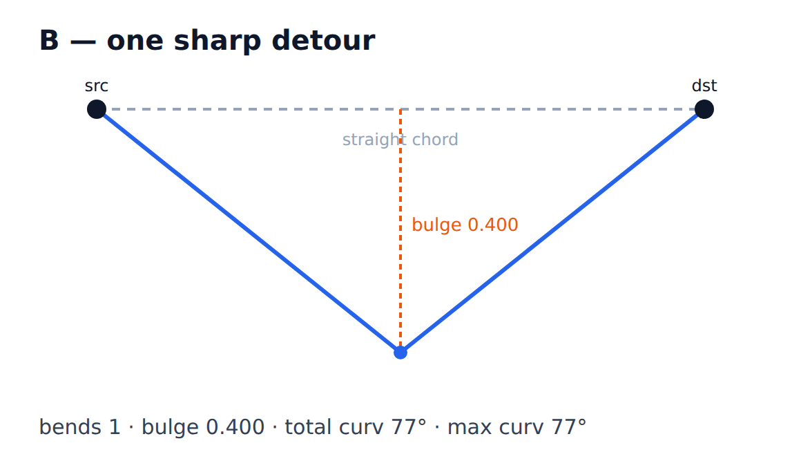
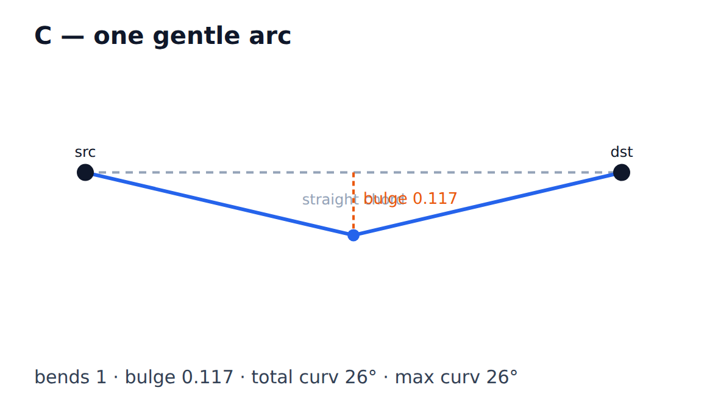
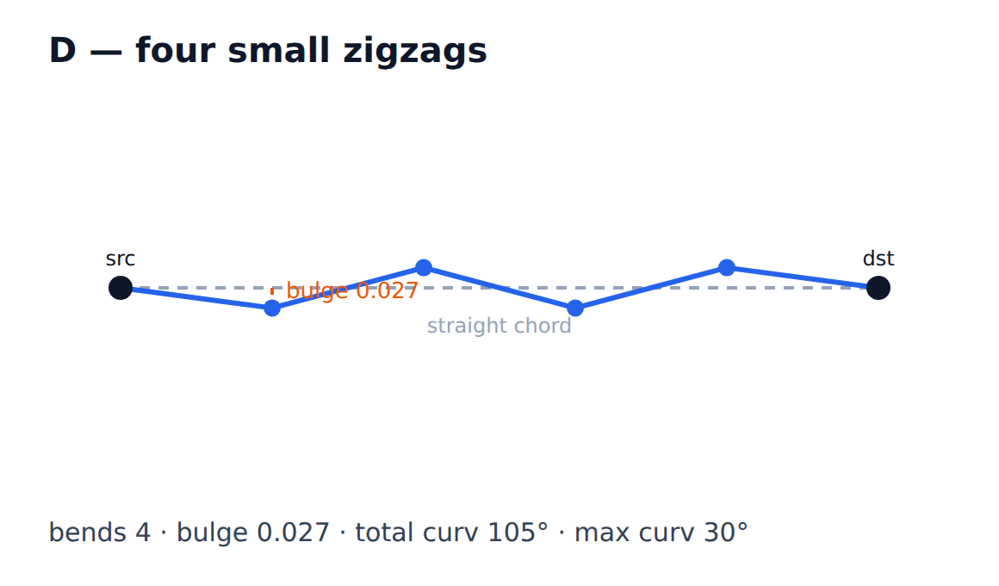
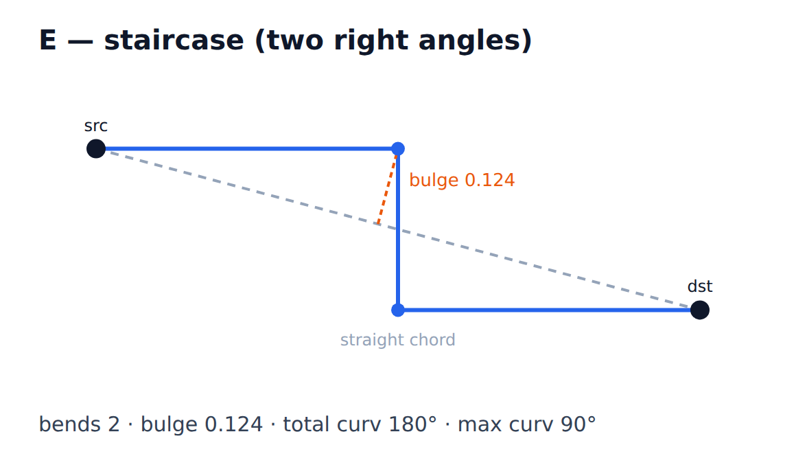

# Bulge vs. curvature vs. bends

The three "aesthetic" desiderata at the bottom of the routing comparator are
easy to conflate, but they measure genuinely different things. An edge can score
well on one and badly on another. This note pins down the definitions (as
implemented in `edge-routing-metrics.ts` / `routing-local-score.ts`) with worked
examples so we rank them deliberately rather than by feel.

## Definitions

- **bendCount** — a raw *count*: the number of interior control points on the
  polyline (`controlPoints.length`, summed over edges). A straight edge is 0.
  It says nothing about *where* the bends are or how sharp they are.

- **maxBulgeRatio** — a *normalized displacement*: the farthest any interior
  point strays perpendicular from the straight chord (src→dest), divided by the
  chord length. `0` = dead straight; `0.4` = the wire bows out 40% of its own
  span. It measures "how far from the direct line does this edge wander", scale-
  free. Only the single worst point matters.

- **totalCurvature** — a *cumulative turn angle* (radians): the sum of the
  turn angle at every interior vertex. A path that changes direction a lot —
  whether in one hard corner or many small ones — accumulates curvature.
  `maxCurvature` is the single sharpest turn; `totalCurvature` is the sum.

## Worked examples

All edges below span the same chord (0,0)→(300,0), length 300. Numbers are from
`/tmp/metrics-demo.mjs` (reproducible — the formulas are copied from the metric
source).

| Edge | shape | bends | bulge | totalCurv | maxCurv |
|------|-------|------:|------:|----------:|--------:|
| A | straight line | 0 | 0.000 | 0° | 0° |
| B | one sharp detour to (150,120) | 1 | **0.400** | **77°** | 77° |
| C | one gentle arc to (150,35) | 1 | 0.117 | 26° | 26° |
| D | four small zigzags (±8px) | **4** | 0.027 | **105°** | 30° |
| E | staircase, two right angles | 2 | 0.124 | **180°** | 90° |

The blue polyline is what the metrics actually measure; the dashed grey line is
the straight chord that bulge is measured against; the orange callout marks the
single worst-case bulge point. Figures are generated by
[`render.mjs`](assets/desiderata-metrics/render.mjs)
(`node notes/assets/desiderata-metrics/render.mjs`).

## What the examples teach

- **bends ≠ curvature.** D has 4 bends, E has 2 — yet E turns *more* total
  (180° vs 105°) because its corners are sharper. Counting bends does not tell
  you how jagged a path looks.
- **bends ≠ bulge.** B and C both have exactly 1 bend, but B bows out 3.4× as
  far. Bulge captures "excursion from the direct line"; bend count is blind to
  it.
- **bulge ≠ curvature.** D barely bulges (0.027) but has high total curvature
  (105°): a near-straight line that wiggles a lot. Conversely a single wide,
  smooth arc can have a large bulge but low curvature.
- **maxCurvature vs totalCurvature.** D's sharpest single turn is only 30°, but
  the sum is 105°. A path of many soft turns and a path with one violent kink
  can have the same total; `maxCurvature` distinguishes them.

## Why this matters for ranking

Because they are independent, the order we put them in changes which trade-offs
the router makes:

- Penalizing **bendCount** first favors few control points — cleaner to edit,
  fewer waypoints — but tolerates a single sharp, far-bulging corner.
- Penalizing **length** next favors short routes over scenic ones.
- Penalizing **maxCurvature** (the single sharpest turn, *not* the sum) keeps
  any one corner from getting too kinked, while staying indifferent to a path
  of many gentle turns (the bend-count tier already discourages those).
- Penalizing **bulge** last lets an edge swing wide around an obstacle when it
  needs to — bulge only breaks ties once bends, length, and the worst kink are
  equal.

Current v2 order (least to most tolerated, after the hard + clearance + crossing
tiers): **bends → length → maxCurvature → bulge**. That says: *first use as few
waypoints as possible, then keep it short, then don't kink any single corner too
hard, and only then prefer staying near the straight line.* Revisit this if
routed edges look wrong — e.g. if edges add needless waypoints, bends is already
strict; if a lone corner looks violent, promote maxCurvature.

> Implemented in `compareLocalScores` (`routing-local-score.ts`) for the v2
> router. The production desiderata comparator (`desiderata-route-edges.ts`)
> still uses its older `bulge → totalCurvature → bends → length` order and uses
> *total* curvature; the two will be reconciled if/when v2 is promoted.

See also: [[plan-incremental-desiderata-v2]], `routing-local-score.ts`
(`compareLocalScores`), `edge-routing-metrics.ts`.
